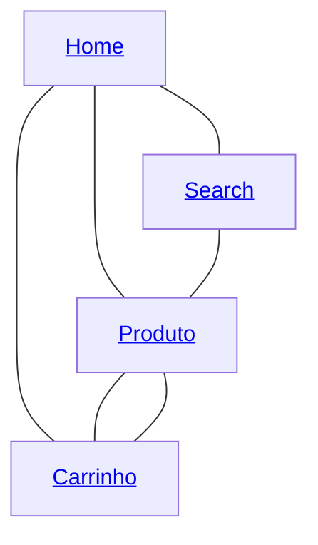

# Crow Store

## Project Report

### Authors

| Name | USP number |
| :--- | :--- |
| [João Vitor Pereira Candido](https://github.com/JV-PC) | 13751131 |
| [Luiz Felipe](https://github.com/lfelipediniz) | 13782032 |
| [Guilherme de Abreu Barreto](https://github.com/de-abreu) | 12543033 |

### Project Description

The CrowStore is a project for an online store for clothing. It's based off of an initial design proposal by one of its team members. To the interested reader, it is available [here](https://github.com/JV-PC/CrowStore).

Its structure follows closely its homepage, where all other pages can be directly accessed, such as product listings, searching and administrator's controls.

## Navigation Diagram

## Project Report

### Requirements

- The system must have 2 types of users: Clients and Administrators

    - Administrators are responsible for registering/managing administrators, customers, and products/services provided. The application already comes with an account admin with password admin.

    - Customers are users who access the system to buy products/services.
  
- The admin record includes, at least: name, id, phone, email.

- Each customer's record includes, at least: name, id, address, phone, email
Product/services records include, at least: name, id, photo, description, price, quantity (in stock), quantity sold.

- Your store may sell products, services or both (you decide)

- Selling Products (or services): Products are selected, their quantity chosen, and are included in a cart. Products are purchased using a credit card number (any number is accepted by the system). The quantity of product sold is subtracted from the quantity in stock and added to the quantity sold. Carts are emptied only on payment or by customers.

- Product/Service Management: Administrators can create/update/read/delete (crud) new products and services. For example, they can change the stock quantity.

- Your functionality: Create a functionality that is specific to your application. It does not have to be something complicated. For instance, if you are selling cars, you may allow users to use an accelerator to hear how each car engine roars up and down.

- The system must provide accessibility requirements and provide good usability. The system must be responsive.

### Comments About the Code

### Test Plan

### Test Results

### Build Procedures

### Problems

### Comments
