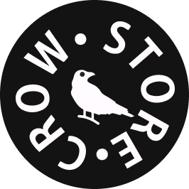

# Crow Store

<p align="center">
  
</p>

## Enter our [website](https://crowstore.vercel.app/)!


### Authors

| Name                                                       | USP number |
| :--------------------------------------------------------- | :--------- |
| [João Vitor Pereira Candido](https://github.com/JV-PC)     | 13751131   |
| [Luiz Felipe Diniz Costa](https://github.com/lfelipediniz) | 13782032   |
| [Guilherme de Abreu Barreto](https://github.com/de-abreu)  | 12543033   |

### Project Description

The CrowStore is a project for an online store for clothing. It's based off of an initial design proposal by one of its team members. To the interested reader, it is available [here](https://github.com/JV-PC/CrowStore).

Its structure follows closely its homepage, where all other pages can be directly accessed, such as product listings, searching and administrator's controls.

### How to run Next JS project

This is a [Next.js](https://nextjs.org/) project bootstrapped with [`create-next-app`](https://github.com/vercel/next.js/tree/canary/packages/create-next-app).

#### Automatically install dependencies

First of all, it's needed to have [Git](https://git-scm.com/downloads), [Node.js](https://nodejs.org/en/download/) and [Yarn](https://yarnpkg.com/) a
installed on your system.

To automatically install all dependencies needed on the project just run: 

```bash
cd CrowStore\ -\ NextJS/

npm i
# or
yarn install
```

#### Getting Started

Run the development server:

```bash
cd CrowStore\ -\ NextJS/

npm run dev
# or
yarn dev
```

Open [http://localhost:3000](http://localhost:3000) with your browser to see the result.

You can start editing the page by modifying `pages/index.js`. The page auto-updates as you edit the file.

#### Learn More

To learn more about Next.js, take a look at the following resources:

- [Next.js Documentation](https://nextjs.org/docs) - learn about Next.js features and API.
- [Learn Next.js](https://nextjs.org/learn) - an interactive Next.js tutorial.

### Navigation Diagram

```mermaid
  graph TD;
      Home[<a href='https://lh3.googleusercontent.com/fife/APg5EOZnSl-KNCo5YlxmlSj5forRPXGg2yky-vdU-ManFLpkRNSbcQaXCYYl3tMpff_tw68Ye9tb-WfyF-TVfrXRwEppkIWS693cCEeJlm2RX9F5Wnai27trAsBbFSGG6g03zTnmNEhS6raT0ithJrj6U1BpyZXo45BC3i7zYpA-Odmf-ElKOV4aKGSFizUQvw7SyCk3E5BSBlfgNq7oK96OOGHYHti5kxPB0Oudd1AEiMdrGBOUiJUL-QADKhdl5aKhzxmWX8fLv9SO00xJIREYS4b5_7grjclrsT_-XkSsbCDh3bSJTCjCVOrH2f7cWfsVPeHOYTt8SwWk9eyo-tj7nz4ZWTBMaGdE73DhxIJeaa22jKyIb5BssJu-27h-h4N4lYkbugZYCZJCtiQ1AZR6tmFnh8ppHjDysQFWZyMI6Te6BmreJsfYwuc_wrpFnh7r83HukN7JwkxanJDIKheUSGyG2QpPVd1PgoNIKz1gd8vqV0LUSHhzIjftallbTbdthUHxsk552NNF5yJX3m7o8XAE73ehG6qf_Ngs37LUT2S7TWPcsE60Cv3z5brIYu2p8bADpL6-SFytaXsObxYL3zfUsm9Ijux34K1Lzg_KrCrZhwlLrmSocSszHvjlHbeXWaUeoglZYsBlNPAxS6M8Kt5fCSiOj-b-bdQ8ELJIowQJoQn67mNdxca3s0nZIr2XuFz4Og0tHtaTc33QVhEVNeyrx3DGPCrTUs6O2yXtRIyIqjnWlp48U5ptw4mSrfMEHtOMselgl0788iB_04Cs9-_2JPDlvr3onKu7_Ygq6cIheCuGxnBgb9cgTXHl3SxAvGuXweAvVJmvVWtpwjSwPoVKFG-w7RP6PMwB_Qh6XnDOUgpKTaCwyHgdD7yROZUEHRwZZL83TdF93CqIkR-Fbw8b2m1HaA4P0fztNHJUwTpB8qY5xyPSaZWgNly6WCzGaQiO8tUeviXYo8j6Nm0OynbFSJToY9ojlKDbhC51vVLJQWubXQec2I9I_41WKTAU8jrAE1tIQVda87g3tbk_RbuOnWUnxSzx_X_J_TfMZlNsjx5SsXQjERdfWOc-Rgtl_A-tJXpKayGoTxqBP6zBs6dHParPy1VmAsx2TG7UqwjOZZP24DaLoBux-oEf_tiJ1S3I0vA6r-mCkjirm2QEfkFX4NDldh17yBgIJ38KxWOUm8k2bQDYf1Ti7miqENawBVncesIEQln_fybmrwEG5jy1h8yEvT9xemRapdytmPSRqwkqgeFtdIekfZ64Nd_KuQbjeHGUwRMeezMFAO6rphHQcjpSfc0ZzCM-eKF5j8PKv_eM4L3Ps_Q8ssQIHoPReRZ7zxzUqvIPKhScGX7UhYookOMaD-b66X-G0dw7g7Qi_Nz1ZLi4v1hFi3CEecx5fzfhETv9cf1K3qD_HfXrcJBJP_QoHpWCUzGpOu2vl-erpLYtZFDF07Pzi6nWBhQuo-tZufd0d0j40RBeJ0mzRT42BifrqD3g4DC3MFRTLJ4jOsLICfnhQzUKoIfLSunT_5a1NE6uSYfjhNDWOtPk7YfIKuxOHMMhDnPD6uZy2GgA0tbylX_0tNIeyA-5b0ZPcLiUC7WNoJ19qvk44I3zbqgAzsdwsqC8PDyBeUj0psI-8tZuE7Q0wzEhFZ5obuAd9KzRsxs1dL0=w1919-h933'>Home</a>]---Carrinho[<a href='https://lh3.googleusercontent.com/fife/APg5EOZ-S1TOGZmVU-ahJswiVVK9H5-EebKGO-ckFBAlduVHIhKnSkJ7CXGuoW04Tm0Yw-TGQRVjS7TBJPB5jP3h5-ntdCuMU3tC9vI5E7o0bFMANM03lmcbHLfSHEU-tiB6G3H_8NHOnI6dDA4MDwA6eKUbOtI9erwKCsbiFMyC6fMYaci4KgjfsJZfEKxaX1WZPQFmT6TCV8gSLd-a3vh12-8MX4a_1MYspQnyE7k0JrfF2xDlWNoHLsR5AVlCcycOLRJ2vVCiqJy1XqTl2W2MWffgStjk-xobKA51mVZ7L5w3XOoyCvRVTHS2hMivG5olzPcPWgEJMBoFNJMK_50k9wwd4CIbPVNEKNh3yVwLH1KtjBSjEExhzZdvZyH94AFH7yDopNNOg3jlw-yzcmrgZ57boufqy5AkESsyUIkCJH-uRVKyXlpxSBSGB9JC9kDWfvHP_y8ays9C_IxrwhIYglgk1MFFb3HZ1Clhhyy3XdNsUqAusN7bXlC0NEr76lyP_aPL9pYQAJRFGvtm20GCVUx8F3cPd2-OFKdmZF6nC5fInEbxxITDY1Gfsr4UfphHFzm5Lb6HwqQWonN2nPaBBcei197mg_-Y6NTiVZrqJv98mjtVhq7OXOISKjt3uKsMxY40jj7ejdToqhyljtlobJ-9g74OA05qZmftuLXtusABw8leQ7NZU94wXWwlUHQNPYceup8Hg9ppgUAwDBwQxXBD5sbKEojpTkZ9avx2ty4LO24yBqHpaDPg77UCJWlp0SjQuECScmO-ilWQA9NWH4hXCGcK55js6TSwlxFBZUqRCp7mIIxjtRRUV3LVcy6QlCh3CU8R5nCwC84_iOcABmEkJz3TvQyIF9q3sJ6CwTR_0XEV3BYWosbbvPNCuJEnzexuDy-7CSep1447oMjsSsmzWPoHiX-IUltDh37mrMejiyc7foy367EB4eYmE-snzMocT1ILqa3b986jtReeTz_ghFBMptEeG9NSu9_eX_XdIqSky8Ojej986U4_ponYvdulZ1WxMOT88kTd83HhCLyUc8eMrgMS9_tYdFtQWbjvH0DfYnv1HVmJpQL4Guc7uxl8WjzuevpTgLo0Yv-jeFxk1DvFHPox7FRJG6nZ8YXT8-3qJJlpUAxz0WGMfc0PHjxemkMPgfelTxxR3uWde19M0byfB8284qcyKjdK2LlLtgeh067lj2xHHf3kMEhEqpwfPpIjAcFp_R8wPymx5aKjeBW3fjRdDoMb3fczezUdxOAOXvX5UPrEL2F2XUpAfw03Mw17xAadRyM-LGA_eevkvqg-Z0lfXv5mmhtfIEMqBMUClKCia-1AvM3W6MJViVdNsefOfhuJh0dtPI0LOu4YQU2atnZ1whrbBcA_VkLWUAJRsmRBFXVY4mHOeTYx_2tw2QY0gUl_2zcuC7wmM0_afBd02Bl1j51wYQ3xzu7REXOE2cI5lRlN81TeDM552GYosoKQv5sMfGVELRoy16R9iOsVYn-PVtkt_T8pqglNWsEIpDUw4e3lxN267eZDAM4F5WO55MBZ9nAJcReNNL29NE6sA2PHusCQi3i08SoKA3Z6vEMpfxgpPDMZDbZjE5c37Jf7FXATV4XDO_j2e6KP-NX4e7zW42g8Dzt1Y2D69LUrTJpDkooRd2YE6XOYIwx9Z6Ox8lU=w1919-h933'>Carrinho</a>];

      Home---LogIn[<a href='https://raw.githubusercontent.com/lfelipediniz/CrowStore/main/Milestone1/mockup-imgs/login.jpg'>LogIn</a>];
      LogIn---Usuário
      LogIn---Admin[<a href='https://raw.githubusercontent.com/lfelipediniz/CrowStore/main/Milestone1/mockup-imgs/admin.png'>Admin</a>];
      Home---Search[<a href='https://lh3.googleusercontent.com/fife/APg5EObNCKxL4nmczWdohUWJQY6O-XS7xOvGnJ9frFhzrAkH6PaCKdnG1BHbSZaFq79Tj5s6isUUVZ-bSZFMdEcYkImjpruiA-LUviHfj9KLAg7mMjFKkbDZwNVnfUkxgSDpImGoHMuP_hevuw5wj8Z4YdsqWxaHURybReOLRlcrVWNSezsWJv5axEWPEfsHBDtbeAkFa_7UBQzVYbjly4osfYNrx9LIHy2sB76lMePLbqVzx6XpXL5-J4vP77kom1_HxfSMeaW8oJxduffhhHNBOuwtVWAjkJaQ_Tf3qZDhHAIR5FpZk0yay9fV7Ys9mDcidjqm9aUiqcid_X81TNiXT522T2I_Q0MJzroTJgGpysD3h3dlr8O8tsI5Oq-1NWcxEDQwJOIhaMV_oKPYPl-k1QfgehWLWlesCIxo8qKlYIxJAfWJoUM05EXPDgaDrLI8uZOyqvs56uPMUFZXZmO6EGsC-ZnSdzeTTsJqfh1E89hLYwls4GUzaPJ4ee0L4sq9zSg1dU-6ZVCtqWRJCUo3lCxdl39SFbUUDCF-W_Ju_i63lZSMcUXOeQ4qtryXhkI4_4ZJPXPKZt-Jgq0XvqegeXF030h9FJzHYaGmLkzOlC0ZWY0EK0GFnp21cbyUF7iMzg_XBNqD08zC_V2fPpKc7eR9ZXVFGQ708My701-Rf5Hb4pPdBqkI2JjOF1yFwMLg4KF7LP7CxvkdXsr3bNQoH6_krIFf-JqBUTNMWV-N-mJxPZfS-saZFxL_uULzpfdo7Y2jcPDJiRnuMB_m5uAy6xftQc8l_gMXsH4d-UQOE8MHBYZ4Jg0KkxpRV9LtwxKVomoTK8QBPvXstt_5UsHImfGi3THw2hMLv_fDh5igzKWY_a08cyAABeC3tzVGE0KJTjRd1pCdCFEiDwxkIfKrRvNWqQ6H28rARfCfwV28zwh8xOlrcQoNh8zMTsjp4W2W2UeWcrCFCbV9GHpHncnT5qrh1OM3FO_HtUTTw3dXzA1FJx2shD36EH9AAAJhpnJhqS_o5Zo8ps-IzUcFA0XHoIfGOHCt0FJg7Fh6U11b76pJ72Cqvlz5n66PVLk_PXxG5nVSITa8b18_T_Z5a9DrHtTqyx80268M5rci3kMEtvCOfiVfVMHBTbZGeArDDXm4JTnpnGx1hAUDKJhoYXX82BOYr6-PsHAkn7NlYuzBvXsN8w2vQOQHklSTHahDjpXfAkSUJjJbA_ldndZ0cRODcGvDfhtZdFOzPEjmtRTPnJ4gWmmJFm-5yKTh8eQl3RdKfjbdsodl0XwW4qH03YnKARAIPJeFGPp3XHvPk3yek8EJT0i7p-Qp5kc756dC0BHIN3jXnxBIKFgmu4vp1FeeZbnRE2Nx5ZWuNMoah_WapeCaqYTI1F-VfCpcVwdBO53ffhKVQCdS4B9vHNYAhjLJ-VkRuxiurVi9YgaK8B9tgW9jupMakQCry8pAFpzZGOOej4UVmUE-5qdo07KRsk7fYdouL-Vxkxt57HwMoxMRdz9OZKAqhhQowg11n3kZLJqfolkk77QhDcHxJjPGLM35IolGZkBL8nBJpHABYJEKWMKTeYsrLOB34Uq6xaatjHuOY6_6GGPVMSnrs_A168zyE9tbMRhBWKBq2brf5VeFQjNc-IYIAA9lNDKYMKrGE7Jc9AsgIU77W8o=w1919-h933'>Search</a>];
      Home---Produto[<a href='https://lh3.googleusercontent.com/fife/APg5EOaVH-xSJFfoEgprKkRNqLphgN1bT06k4Sp6brd0guljlBp7hicCZzNGQfEPvAFGnBR-CsGTjehakL1uAR3C_U92O9qzi8GBEbDfLPCmo3tFRVBXBvRH5YNDMoDL8lXzphVkGLTZYxg5GBDWTyz_Zr9rP4bhTPnULxng6tobqMURaDTLdaX9QoC1uVndvAGAWDZYCkc4kD-QTqBvyAhizC4aOCelW8k8rZcTbCA1e_tAIIe9rKWJq1P2ZceFEsccVGx9U-lnRjDza7kk8kdit-EGkmt_WzwFfuF62EPayUQt8eC6QSI2BY9GTYAP6VkXwBRsw4nssY5JD8zwy8QK7ydoXQ6Qaz1Tm-qXDsMYl5WwWylESCOXH_CuYkp_WI-O04s6OMRYE9Dets5XVevdai08n1Z6OEGaacDQfszBLUmTmCkQwGGv8aVXPMR24meMKcry4LFhIhIvt-5r0Fg_Ld6ia9pfnsl4wilXP7vHM6K1hWRjsUIjTuezhDX3hA3CvUP2-PKllK2t012xmrdpQv5G_T14oTJTF3IkwxaYLb6WjHEFHlivzSmXdN75GlObR1SooeXLvVVAxiiu7HdhuIy0sn9RwZh02xWWeqWfJwXJmxj5G4O1lbRDsA-Vo4stLTyojUrPaHcYHb_Q1WUkFPhoHsXYWdMspoXe-Rvw3T08OqzxOuZjS6NiIosHnbjeusAKnCflpRJTTWRxhSKt5xXRWECdmkXvfBut769OBhWi7XmhxmLoI-4osv-mFFPt5afL5nBeEfPL02kJcPeaujfcW4jgKlJOYH4f8mTfIK-aVarTMRWV_3g9YS4fIps5ho4W5sM-yDJSgsr-t2rQfOXikWoNoiif_qtN2ZrVm1KXumLW7UiKzSF7EEK1KKw4Kx_Fggkcbo_dLB2eHG2xtvrtpYxp3nGPjxsnXdgzo3optxAdxdhb2Yw5uSFeLHat6t081zSrlSj0b8AP1fjSTB4rtirkgVWN_TwBJXnxGBTBkhujHiU9FGcXX6jCZoxOfl8DbL8e6BC6JyFaHa-8Erm4vffL6tKlJKzhDh9_OFPX4iKuHo-eq833up0jb-Wvv_Fm5znlwvxZjipycuCI68RBngfX7iU8beb-pGHWsAorxx76M7OFbMg8cl1KrWDfEFhnGe4PrGgv96OjglwMMu4Ykzz4lnyDuumSjIAX7C1YL8w1zFO_5kGx0eZirkGFXFTHMcFgC2xUojItT_dNKx0IZbFA-Tv_S6J9Yk6pZ4_mDMokQrU9fYdtnLq8ZS6Q-QkRvBevVV_9HY4FI0Y4uzA8g-r7g8G4ApULoe_HzZaeJ36aiGzIrWXKlSNY6L0_Gi4-JwrAiAwjKbSgZk9Sz6_3h4HxJgDRx2Fs27hTt3I7dnnfLH9HJolb8P6UdcC_UdYu29EHG4hZoY2gFDpwvsyHXWqdGaKXcdEeOX2b-pWSkV_8OF60Z7J9SnJc0QY-gA7ZX6sbJ61yi0RtfPMIQrSH-xqtnuOOOF0Q2c7iynX-kVs1-UNCwBUI9KViF5nsbfwh0Nan4MlCJ8rB7APgUbuBOp9Yjf29F4iQSdWFNWUFnDaZKtVfr4eVZvD3dsrpnhlOCYl1S6NLZBqYIjVFrT7iZdTr66uZBzXwISSFyLlLHtK7JAFO3vteq90f-AtTp7Ko2b78nBI=w1919-h933'>Produto</a>];
      Search---Produto
      Produto---LogIn
      Produto---Carrinho
      Home---Carrinho
      Usuário---Carrinho
      LogIn---Carrinho
```



### Mockup images

<div style="align: center;">
  
</div>

Samples of this site's pages appearance can be found in this [**folder**](https://github.com/lfelipediniz/CrowStore/tree/main/Milestone1/mockup-imgs)

### Requirements

- The system must have 2 types of users: Clients and Administrators

  - Administrators are responsible for registering/managing administrators, customers, and products/services provided. The application already comes with an account admin with password admin.

  - Customers are users who access the system to buy products/services.

- The admin record includes, at least: name, id, phone, email.

- Each customer's record includes, at least: name, id, address, phone, email
  Product/services records include, at least: name, id, photo, description, price, quantity (in stock), quantity sold.

- Your store may sell products, services or both (you decide)

- Selling Products (or services): Products are selected, their quantity chosen, and are included in a cart. Products are purchased using a credit card number (any number is accepted by the system). The quantity of product sold is subtracted from the quantity in stock and added to the quantity sold. Carts are emptied only on payment or by customers.

- Product/Service Management: Administrators can create/update/read/delete (crud) new products and services. For example, they can change the stock quantity.

- Your functionality: Create a functionality that is specific to your application. It does not have to be something complicated. For instance, if you are selling cars, you may allow users to use an accelerator to hear how each car engine roars up and down.

- The system must provide accessibility requirements and provide good usability. The system must be responsive.

### Comments About the Code

A comment about the mockups and the navigation diagram developed. We are trying to faithfully follow what was proposed through mockups and the navigation diagram. We believe that we will be very faithful to what was presented through them.

For the first delivery, the mockup was used and now the react backend, with elements based on the aesthetics presented by the prototype initially presented as an idea for the site.

For the second delivery, polishing and a large part of the backend of the project were done, aiming at a quality delivery. In addition, the visualization of the same in different screen resolutions was also thought.

### Test Plan

The initial plan is to use the navigation diagram to test the full functionality of the site.

For the second delivery, you already have an application usable when running the application (frontend and backend together), facilitating the testing of its functionalities.

### Test Results

We follow the philosophy of testing while the application is running. These tests forever served as a greater visualization of the implementation of new features, observing when a new feature was added, so that none of the others were compromised in the process and, if they were, they should be fixed.

### Build Procedures

You can clone the repository using the command: 
git clone https://github.com/lfelipediniz/CrowStore

This is a [Next.js](https://nextjs.org/) project bootstrapped with [`create-next-app`](https://github.com/vercel/next.js/tree/canary/packages/create-next-app).

#### Automatically install dependencies

First of all, it's needed to have [Git](https://git-scm.com/downloads), [Node.js](https://nodejs.org/en/download/) and [Yarn](https://yarnpkg.com/) a
installed on your system.

To automatically install all dependencies needed on the project just run: 

```bash
cd CrowStore\ -\ NextJS/

npm i
# or
yarn install
```

#### Getting Started

Run the development server:

```bash
cd CrowStore\ -\ NextJS/

npm run dev
# or
yarn dev
```

Open [http://localhost:3000](http://localhost:3000) with your browser to see the result.

You can start editing the page by modifying `pages/index.js`. The page auto-updates as you edit the file.
Or, you can access it to visuaalization through this [link](https://crowstore.vercel.app/) here.


### Problems
Some problems still need to be documented, like some warnings in the console, and they will be in the future, because some of those problems are due to unfinished project steps.

### Comments

Aditional comments:
The project is going as expected, and we are on the way to deliver a great website.
